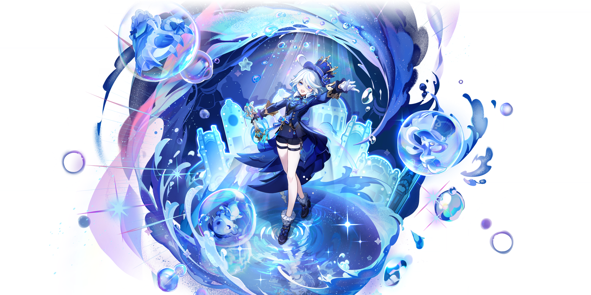

# ✨ Furina do Discord

Um bot do Discord inspirado na Arconte da Justiça — **Furina**, de Genshin Impact — com sistemas interativos, sorteios personalizáveis, rank de aventureiro, economia de Primogemas e muito mais.

---

## 🌊 Funcionalidades Principais

- 🎭 **Sistema de Sorteios Avançado**  
  Com botões de participação, requisitos de cargos e mensagens, reroll, edição, encerramento e persistência em clusters.

- 💎 **Sistema de Primogemas**  
  Ganhe, envie ou visualize sua economia pessoal com comandos como `/primogemas ver`, `/primogemas pagar` e `/primogemas rank`.

- 🗺️ **Exploração de Regiões**  
  Envie personagens para explorar Mondstadt e volte com baús valiosos e primogemas. Totalmente integrado ao sistema de tarefas.

- 📈 **Rank de Aventureiro (AR)**  
  Acumule EXP com suas ações e suba de nível. Ao subir, recebe prêmios e ativa notificações por DM e logs automáticos.

- 📅 **Recompensas Diárias via Website**  
  Diárias exclusivas desbloqueadas no AR 17. Link direto:  
  🔗 [`/recompensas-diaria`](https://furina-do-discord.onrender.com/recompensas-diaria)

- 📊 **Rankings Globais e por Servidor**  
  Compare sua jornada com outros aventureiros, em rankings divididos por servidor ou globalmente.

---

## 🧩 Tecnologias Utilizadas

- Node.js  
- Discord.js v14  
- MongoDB + Mongoose  
- Canvas  
- discord-hybrid-sharding  

---

## 🌐 Website Oficial

Explore mais do projeto e interaja com recursos externos:

🔗 **[https://furina-do-discord.onrender.com](https://furina-do-discord.onrender.com)**

---

## 🎨 Créditos

- Desenvolvido por [ThallesKraft]  
- Personagem baseada em: **Furina (Genshin Impact)**  
- Todos os direitos dos personagens pertencem à HoYoverse  
- Este projeto é feito por fãs, sem afiliação oficial

---

## 📜 Licença

Este repositório é destinado a fins educacionais e uso pessoal.  
Não é permitido uso comercial ou redistribuição sem permissão.

